DEMO - Azure Functions tools for Visual Studio 2017
=====================================================
 This file contains a sample script if you are delivering this sample as a demo. 
 

## Setup ##
Please [follow the Setup Instructions](SETUP.md) to get your environment configured.

## Deliver as a Demo - Video ##

Here's an example recording of the demo:

## Demo Script ##

### Section 1: Azure Functions tools for Visual Studio 2017 ###

This section highlights the benefits of creating Azure Functions in Visual Studio 2017: compiled class libraries, attribute based function definition, intellisense, live unit testing, local debugging.

| Screen | Steps | Script |
|--------|-------|--------|
|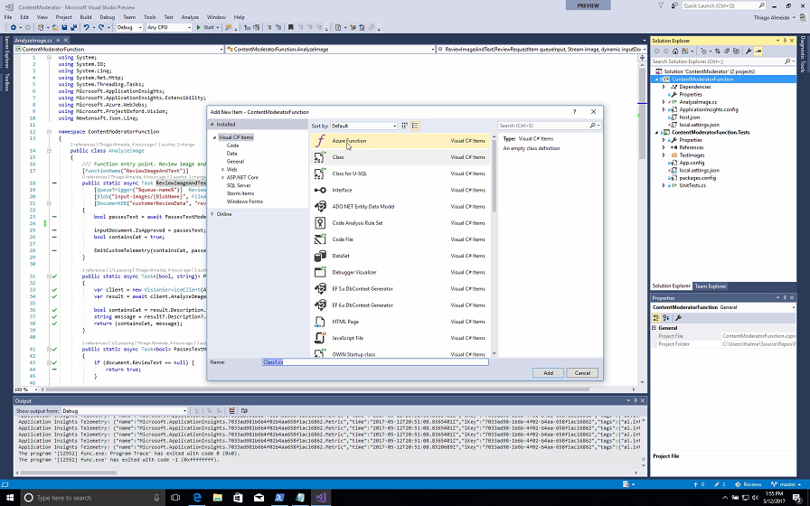
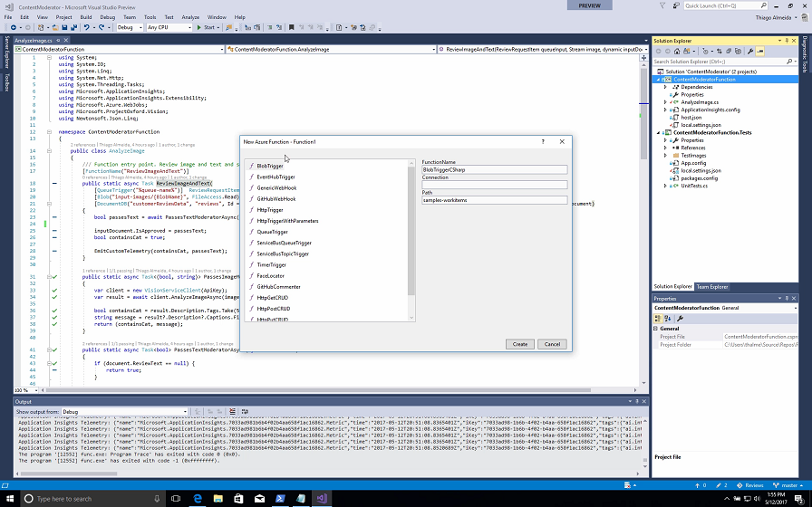|In Visual Studio with the Content Moderator solution open, right Click on the ContentModerationFunction project and select Add -> Class -> Azure Function as you are talking.| Hi everyone – I’m going to show you the new Azure Functions tooling for Visual Studio 2017 that will provide you and your team with the best support for creating, deploying and monitoring serverless solutions. My team and I have created a website for customers to upload cat product reviews, including a picture and a comment. But we wanted to automate the moderation of those reviews, so we created a serverless function using Azure Functions. By using Azure Functions, I don’t have to maintain a separate server. The platform scales out automatically based on the workload, and I pay per execution. And with our great Visual Studio tooling you can super productive in this new compute model. The first thing to notice is we have an updated File->New experience to create a new Azure Function project or to add a new Azure Function class, where you can set the triggers and bindings right here. Let me show you the one we created for the moderation though.|
|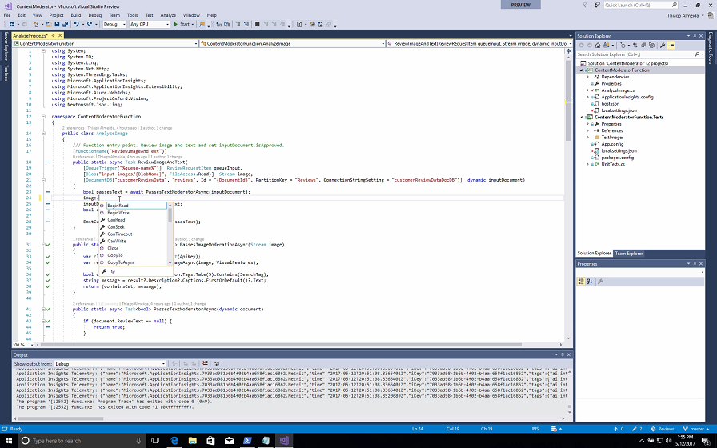|Use the mouse to point at the Azure Function class definition.
Show IntelliSense by typing ``image`` in the code.|Our new tooling is based on .NET class libraries, which means you get the full support of Visual Studio 2017 features like IntelliSense, debugging and more.|
|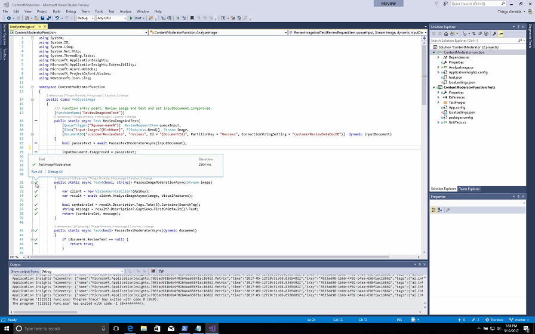|Show Live Unit testing in sidebar.|I can also take advantage of the new Live Unit testing feature so I can see the latest unit test status right in the editor.|
|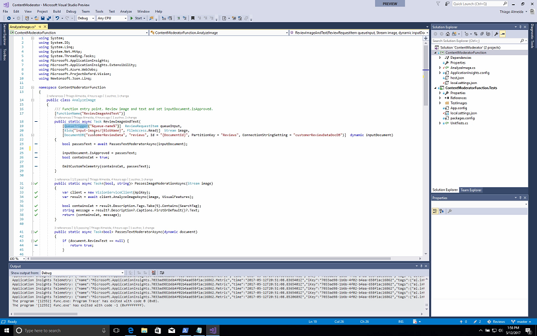|Highlight the Queue, Blob, and DocumentDB attributes – don’t move mouse around so you don’t distract audience from what you’re saying|Also new is that you can now use attributes on your Function method declarations for its triggers and bindings, so you don’t need a separate metadata file for this. It makes really easy to understand your function. As you can see, my function is triggering from a storage queue, where the website puts alerts for my function to know that there’s a new review; and binds to blob storage where the review picture is, and to a DocumentDB document where the review text and other info are.|
|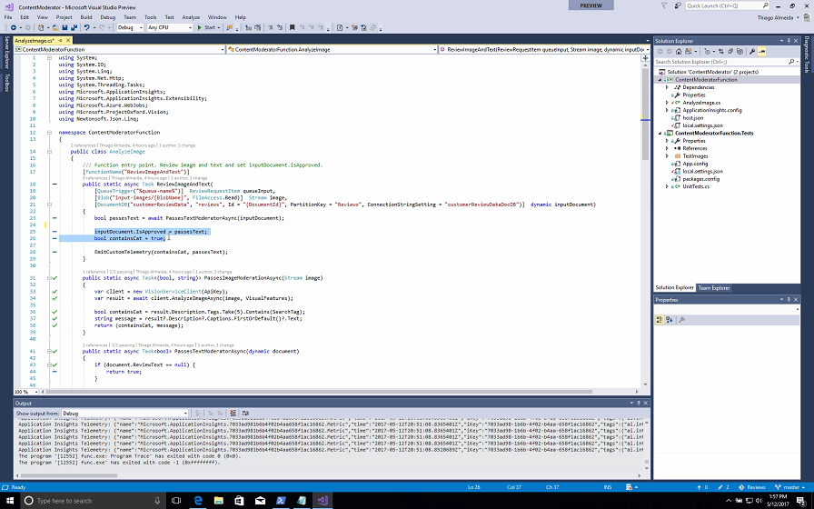|Highlight the text moderation code|My function right now is only reviewing the text of the review, by calling out to the content moderation Microsoft Cognitive API to ensuring the text is safe. But I would also like to moderate the image itelf to ensure it’s safe and contains a picture of a cat. So let me add the code for that.|
|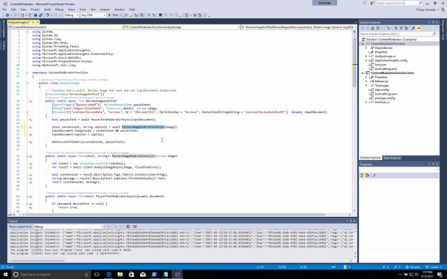|Select the following two lines:
 ``InputDocument.IsApproved = passesText;`` ``Bool containsCat = true;`` 
 and replace them with three new lines:
``(bool containsCat, string caption) = await PassesImageModerationAsync(image);``  ``inputDocument.IsApproved = containsCat && passesText;``  ``inputDocument.Caption = caption;``
If you use AutoHotKey there's a ``Serverless.ahk`` file in the ``Reset\assets`` folder with ``Control+Shift+a`` configured to paste these lines.|Ok - now I’m also using the Vision API to also review the image too!|
|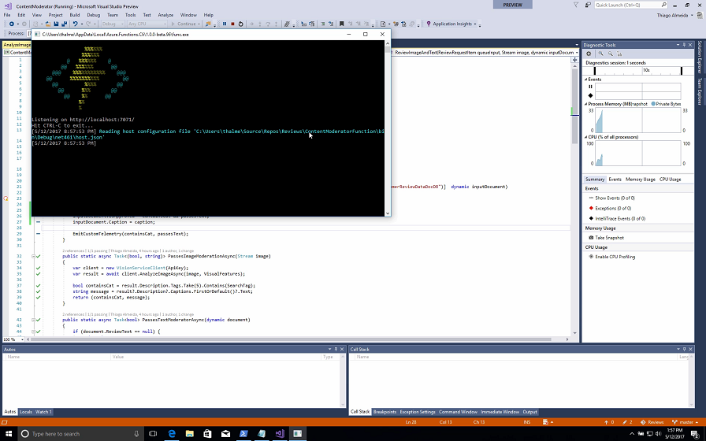|Add breakpoint to the ``EmitCustomTelemetry`` line.
Click the Run button to start debugging.
Switch to browser|Now that my code changes are done, I want to make sure this is all working. I can just set a breakpoint, and I love that I can now debug this function locally, while still interacting with azure storage and document db. I’ve started debugging locally, so let’s switch to our dev website to add a new review.|
|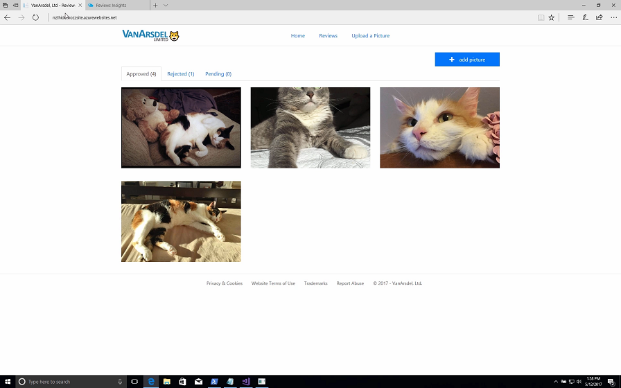|Click on the ``+ Add Picture`` button|As you can see I already have a few successful reviews. Let’s add a new photo that will fail our image moderation.|
|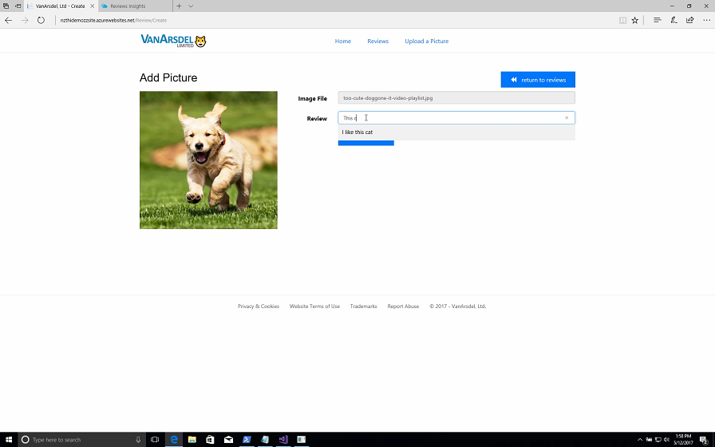
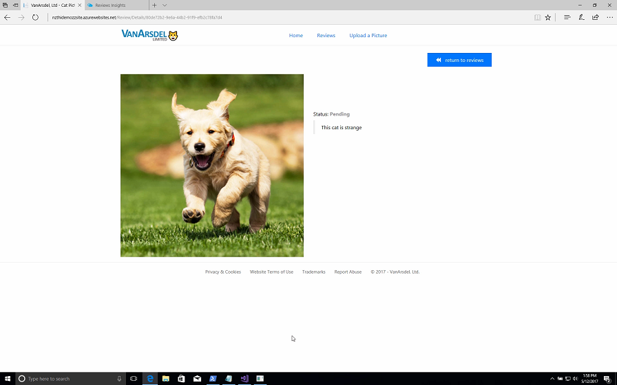|Click on ``+Image``.
Select the dog image.
Click on Review textbox.
Enter a review text in the textbox (or enter ctrl+shift+b to paste review text if using AutoHotKey).
Click create, wait for image and Pending status to show.
Switch to Visual Studio|Don’t worry: it’s just a photo of a dog. Given this is a cat review site our Function should fail anything that’s not a cat. I’ll enter my review here. And that should trigger our queue with this new review|
|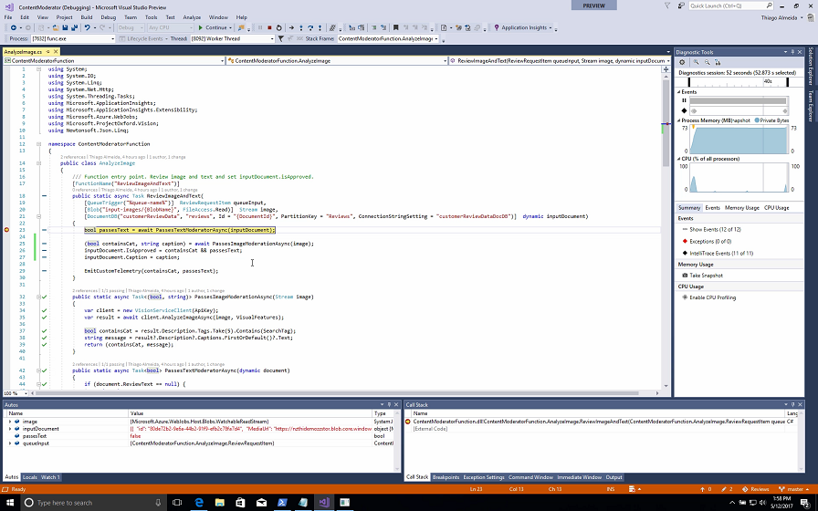|Hover over queueInput.
Hover over containsCat.
Hover over caption (not inputDocument.Caption).
Click Continue button and switch back to website|Great, we’ve hit our breakpoint. This is the amazing part, that no other serverless platform offers: I can trigger off Azure events even when I’m running locally. This is not an emulator or simulator, it’s the actual Azure Functions runtime on my local machine.
My function triggered from the queue message that the site created, and I can see the queue contents right here. And I can see the result that comes back from Cognitive Services. And it will even give me a caption that it’s a small white dog. This will update the status of the document in DocumentDB. So let’s continue here and go back to the website.|
|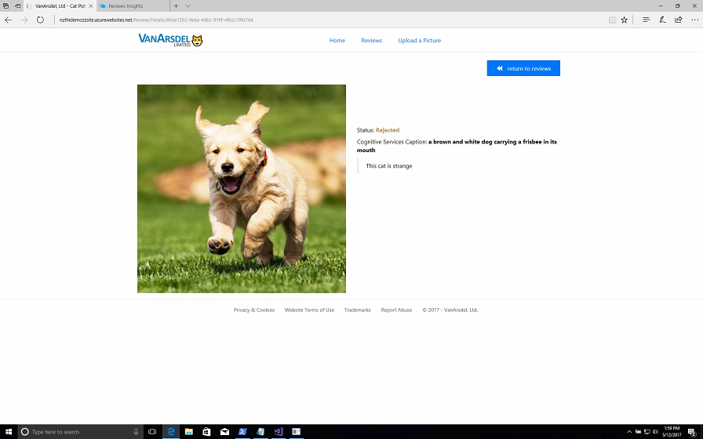|Refresh the page. Switch back to Visual Studio|I’ll refresh the page to check. And, as expected, this picture shows as Rejected. Ok, I’m happy that my function code update is working, time to ship it!|
|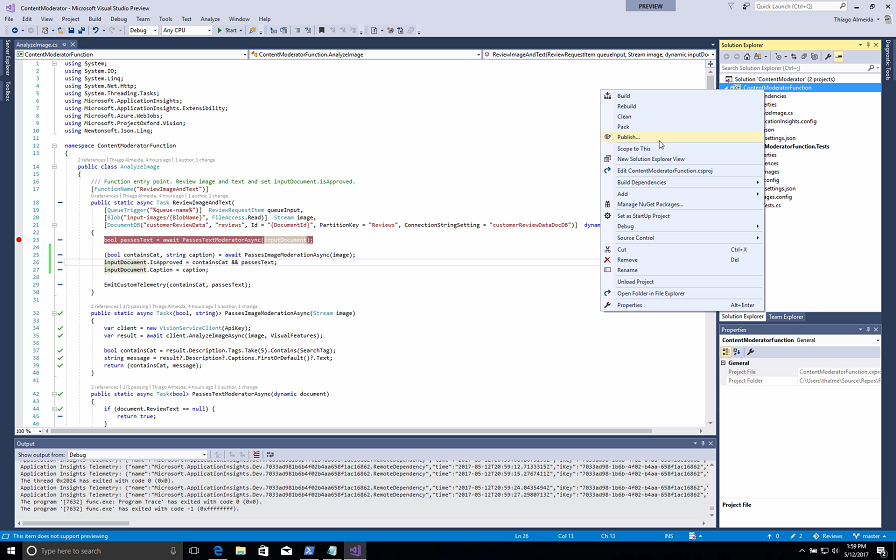|Show Green unit tests. Right click on project and select Publish|Looks like my live unit tests are still passing. So let’s have a look at how easy we can publish and deploy our function. The easiest way to do this is to right click on my project and select Publish.|
|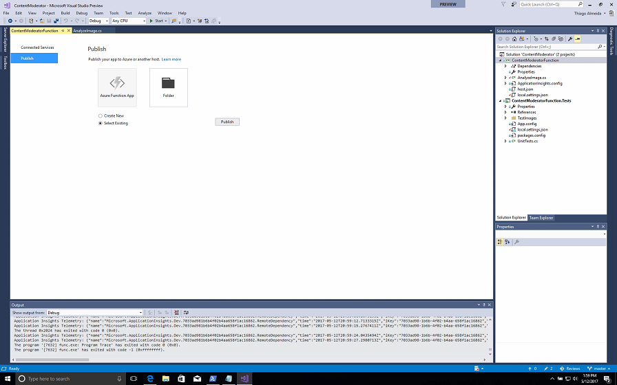|Cancel out of publish window|Here I can decide to publish directly to an Azure Function I already have created on Azure, or create a new one.
(If doing the next section also say the following:) But my team and I are leveraging the best tool for teams to implement continuous delivery of any code to Azure: Visual Studio Team Services, so let's kick that off.|

### Section 2: Continuous Integration ###

This section highlights how Visual Studio Team Services can be used to implement continuous integration and deployment of the Azure Function code.

| Screen | Steps | Script |
|--------|-------|--------|
|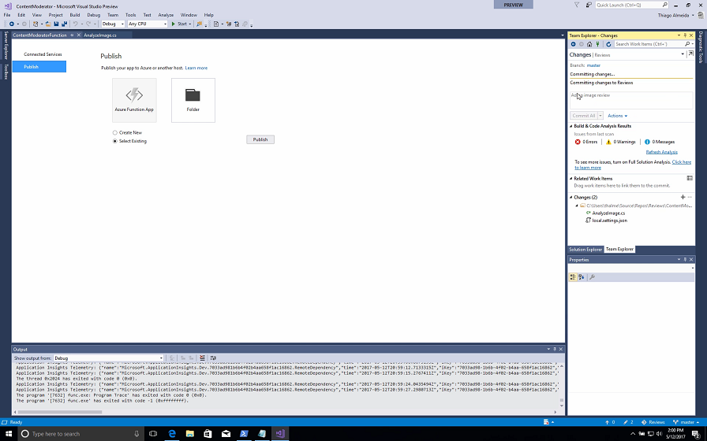|Right click on solution and select Commit.
Select the commit textbox and enter a short commit text (or click Ctrl+Shift+c to paste the commit code if using AutoHotKey).
Click on Commit and Push|Without even leaving my development environment I’ll commit these changes to our repo|
|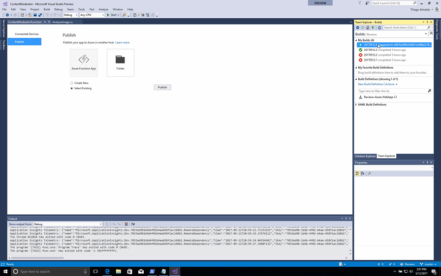|<Talk through to give it time to trigger the build>. Switch to Team Explorer - Builds.
Right click on latest build and select Open|And this will trigger an existing continuous integration pipeline that our team created with VSTS to build and test my changes. If it's successful I can submit a pull request here in Visual Studio or in VSTS and let my function code get reviewed by my team, and once merged it'll be deployed by VSTS to test and eventually a production environments.
(once the build shows as running in Team Explorer) Ok, looks like my build is under way. I want to learn more about this build run so I’ll right click and open it|
|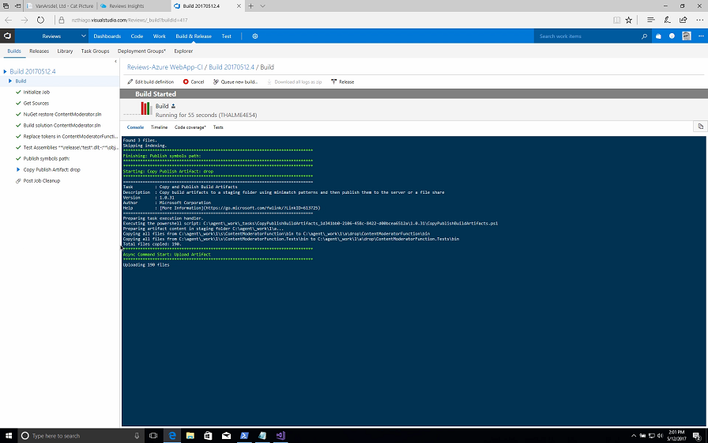|Show the build running/or finalized if done already.
Change back to Visual Studio|So here you can see our build is successful, passed the unit tests, and our latest code is ready to be pushed up to my dev Azure Function on Azure by a VSTS release definition. (tie in to Section 3:) We have this solution already deployed to Azure, and now I want to close the loop and see how users are using it and how it is behaving.|

### Section 3: Application Insights ###

This section highlights how Application Insights custom telemetry can be surfaced on Azure along with overall telemetry from the demo website.

| Screen | Steps | Script |
|--------|-------|--------|
||Point out in the code the ``EmitCustomTelemetry`` call.
Show the ``EmitCustomTelemetry`` method code.
Change to Azure Portal tab in the browser|In addition to the best development tooling and great integration with Visual Studio Team Services, we can take advantage of Application Insights to easily build custom telemetry into my application. You will see that with a few lines of code I am collecting and storing application telemetry for deep insights and analysis. So let's switch to the Azure Portal to see this in action against our production website.|
|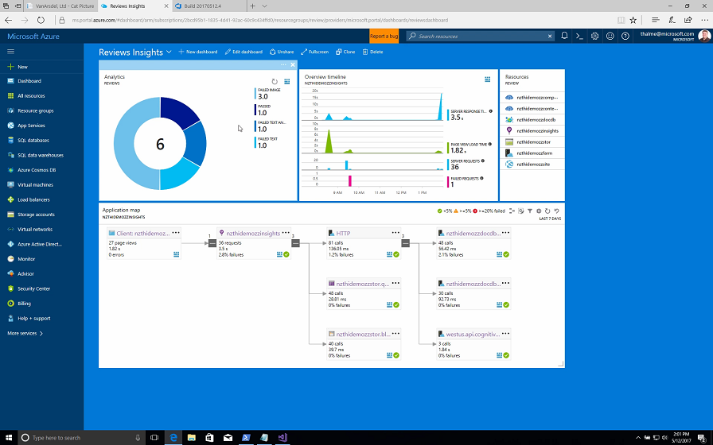|(in the shared Reviews Insights dashboard) Mouse over the donut wheel.
Hover over a couple of areas of the donut.
Hover over the application map.
Click on edit query in the donut or tab to already opened tab|When we go to the Azure portal we have rich visualizations and deep insights about how my app and my function are performing in a shared dashboard used by my team. For example I can see how many Reviews have been approved or rejected and why. I can also see how many calls are being made to my site, Azure Function, and their dependencies, and the latency of these calls. And if I need to I can drill into the specifics of my telemetry using Application Insights Analytics|
|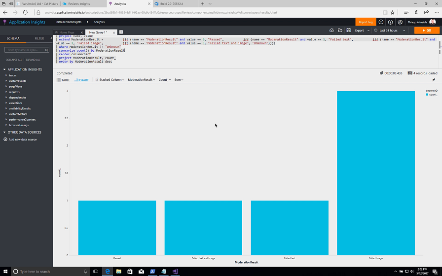|Change the type of query result to ``barchart``
Click Go to run the query again.|Here I can drill in to individual requests, aggregate my results in a different way. I can change the view type and re-run the query. I can export it to our Azure Portal dashboard as you saw, or use this as a source in Power BI.
So, with Azure Functions, Visual Studio, Team Services, and App Insights you and your team have the best tooling for creating, deploying and monitoring serverless solutions. Now go install the latest Azure Functions support for Visual Studio and create your serverless solutions! Thank you|

