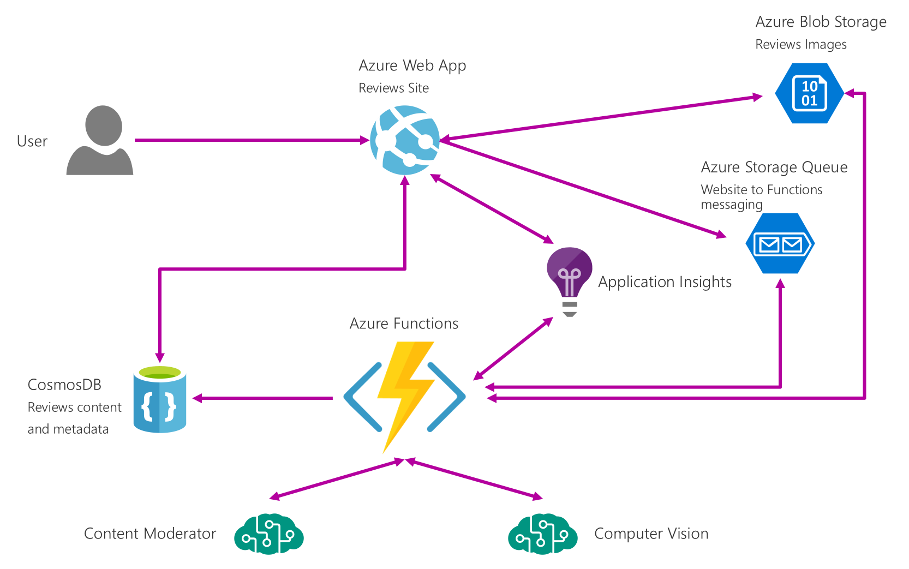

# Sample - Customer Reviews App with Cognitive Services (Azure Functions tools for Visual Studio 2017)

This sample showcases the new Azure Functions tooling for C# Class Libraries in Visual Studio. It has a website where customers submit product reviews, stored in Azure storage blobs and CosmosDB; and an Azure Function to perform automated moderation of the customer reviews using Microsoft Cognitive Services. It uses an Azure storage queue to decouple the website from the function.
 

## Setup ##
Please [follow the Setup Instructions](SETUP.md) to get your environment configured.

## Sample Highlights ##

### Sample Architecture ###

Here's a view of the architecture of the sample:

### Deliver as a Demo ###

**Here is the [demo script](DEMOSCRIPT.md)**.

And here's an example recording of the demo:

### Section 1: Azure Functions tools for Visual Studio 2017 ###

This section highlights the benefits of creating Azure Functions in Visual Studio 2017: compiled class libraries, attribute based function definition, intellisense, live unit testing, local debugging.

| Screen | Steps | Notes |
|--------|-------|--------|
|
|In Visual Studio with the Content Moderator solution open, right Click on the ContentModerationFunction project and select Add -> Class -> Azure Function.| The demo includes a website for customers to upload cat product reviews, including a picture and a comment. You can change the whole sample with a different type of product reviews by updating the sample images and the cognitive services code. The team already built a function to automate the moderation of those reviews, using an Azure Storage queue to decouple the website and the automated moderation performed by the serverless function using Azure Functions. By using Azure Functions, you don’t have to maintain a separate server. The platform scales out automatically based on the workload, and you pay per execution. And now with the great Visual Studio tooling you can be super productive in this new compute model. The first thing to notice is we have an updated File->New experience to create a new Azure Function project or to add a new Azure Function class, where you can set the triggers and bindings right here. But you can cancel out of it and explore the one we already created for the reviews moderation.|
||Review the Azure Function class definition.
You can see IntelliSense by typing ``image`` in the code inside the method.|Our new tooling is based on .NET class libraries, which means you get the full support of Visual Studio 2017 features like IntelliSense, debugging and more.|
||Enable Live Unit Testing if using Visual Studio 2017 Update 3 Enterprise Edition.|You can also take advantage of the new Live Unit testing feature to see the latest unit test status right in the editor. There's two simple tests that get run from the Tests project.|
||Check out the Queue, Blob, and CosmosDB attributes in the method |You can now use attributes on your Function method declarations for its triggers and bindings, so you don’t need a separate metadata file for this. This makes it really easy to understand your function. As you can see, this function is triggering from a storage queue, where the website puts alerts for my function to know that there’s a new review; and binds to blob storage where the review picture is, and to a CosmosDB document where the review text and other metadata are.|
||Look at the text moderation code|The function right now is only reviewing the text of the review, by calling out to the [Content Moderation Microsoft Cognitive API](https://docs.microsoft.com/en-us/azure/cognitive-services/Content-Moderator/text-moderation-api) to ensure the text is safe. Now you can edit the function to also moderate the image itelf to ensure it’s safe and contains a picture of a cat.|
||Select the following two lines:
 ``InputDocument.IsApproved = passesText;`` ``Bool containsCat = true;`` 
 and replace them with three new lines:
``(bool containsCat, string caption) = await PassesImageModerationAsync(image);``  ``inputDocument.IsApproved = containsCat && passesText;``  ``inputDocument.Caption = caption;``
If you use AutoHotKey there's a ``Serverless.ahk`` file in the ``Reset\assets`` folder with ``Control+Shift+a`` configured to paste these lines.|Now you're also using the Vision API to review the image too. It ensures there's a cat in the image.|
||Add a breakpoint to the ``EmitCustomTelemetry`` line.
Click the Run button to start debugging.
Switch to browser tab with your Reviews website open.|Now that your code changes are done, you can make sure this is all working. By setting a breakpoint you now debug this function locally, while still interacting with Azure Storage and CosmosDB. You’ve started debugging locally.|
||Click on the ``+ Add Picture`` button on the website.|you can add a new photo that will add a message to the Storage queue and trigger the function running in Visual Studio. Try a photo that will fail image moderation (a photo without a cat).|
|
|Click on ``+Image``.
Select the dog image.
Click on Review textbox.
Enter a review text in the textbox (or enter ctrl+shift+b to paste review text if using AutoHotKey).
Click create, wait for image and Pending status to show.
Switch to Visual Studio|Given this is a cat review site our Function should fail anything that’s not a cat. And that should trigger our function with this new review.|
||Once the breakpoint is hit, check out the values of queueInput, containsCat, and caption (not inputDocument.Caption).
Click Continue button and switch back to website| This is the amazing part, that no other serverless platform offers: you can trigger off Azure events even when you're running locally. This is not an emulator or simulator, it’s the actual Azure Functions runtime on your local machine.
The function triggered from the queue message that the website created, and you can see the queue contents right here. You can also see the result that comes back from Cognitive Services. It will even give you a caption of the picture you uploaded. The function also uses the binding to update the status of the document in CosmosDB.|
||After the function finishes executing, refresh the website page. It should show the result of the moderation as Rejected and a description of the picture. Switch back to Visual Studio|If you're happy with the function code update, it's time to ship it!|
||If you have Live Unit Tests going, check that the green unit tests ticks are there. Right click on project and select Publish. |The unit tests would have automatically run again when you added the image moderation code. Let’s have a look at how easy you can publish and deploy the function. The easiest way to do this is to right click on my project and select Publish.|
||If using VSTS you can cancel out of publish window, otherwise you can publish it directly from here in Visual Studio.|Here you can decide to publish directly to an Azure Function that you already have created on Azure, or create a new one using the Publish wizard.
If you and your team are leveraging Visual Studio Team Services, the best tool for teams to implement continuous delivery of any code to Azure, continue to the next section.|

### Section 2: Continuous Integration ###

This section highlights how Visual Studio Team Services can be used to implement continuous integration and deployment of the Azure Function code.

| Screen | Steps | Script |
|--------|-------|--------|
||Right click on the in Visual Studio and select Commit.
Select the commit textbox and enter a short commit text (or click Ctrl+Shift+c to paste the commit code if using AutoHotKey).
Click on Commit and Sync|Without even leaving your development environment you'll commit these changes to your repo and trigger a build.|
||After a while, open Team Explorer - Builds in Visual Studio Team Services.
Right click on latest build and select Open|Commiting the code will trigger an existing continuous integration pipeline that you created with VSTS to build and test your changes. In a real scenario you would also submit a pull request from Visual Studio or in VSTS and let your function code get reviewed by your team, and once merged have it be deployed by VSTS to test and other environments using Release Management.
If you want to learn more about this build run you can right click and open it from Visual Studio|
||Check out the build running/or finalized if done already in VSTS|Here you can see your build is successful, passed the unit tests, and your latest code was pushed up to your dev Azure Function by VSTS. You have this solution already deployed to Azure, and now you can close the loop and see how users are using it and how it is behaving.|

### Section 3: Application Insights ###

This section highlights how Application Insights custom telemetry can be surfaced on Azure along with overall telemetry from the demo website.

| Screen | Steps | Script |
|--------|-------|--------|
||Check out the code the ``EmitCustomTelemetry`` method to see how the custom telemetry is being sent.
Open your Azure Portal tab with the Customer Reviews cusom dashboard in the browser|In addition to the best development tooling and great integration with Visual Studio Team Services, you can take advantage of Application Insights to easily build custom telemetry into your application. You will see that with a few lines of code you're collecting and storing application telemetry for deep insights and analysis.|
||Mouse over the donut wheel in the shared Reviews Insights dashboard.
Hover over a couple of areas of the donut to see their values.
Hover over the application map and interact with it.
Click on the edit query button in the donut to get to the Application Insights Analytics portal|When you go to the Azure portal you have rich visualizations and deep insights about how your app and your function are performing in a shared dashboard. For example you can see how many Reviews have been approved or rejected and why. You can also see how many calls are being made to your site, Azure Function, and their dependencies, and the latency of these calls. And if you need to you can drill into the specifics of the telemetry using Application Insights Analytics|
||You'll see type of query result changed to ``barchart``
You can click Go to run the query again and see the results as barchart.|Here you can drill in to individual requests, aggregate your results in a different way. You can change the view type and re-run the query. You can export the new view to your Azure Portal dashboard, or use this query as a source in Power BI.
So, with Azure Functions, Visual Studio, Team Services, and App Insights you and your team have the best tooling for creating, deploying and monitoring serverless solutions.|

# Contributing

This project has adopted the [Microsoft Open Source Code of Conduct](https://opensource.microsoft.com/codeofconduct/). For more information see the [Code of Conduct FAQ](https://opensource.microsoft.com/codeofconduct/faq/) or contact [opencode@microsoft.com](mailto:opencode@microsoft.com) with any additional questions or comments.
