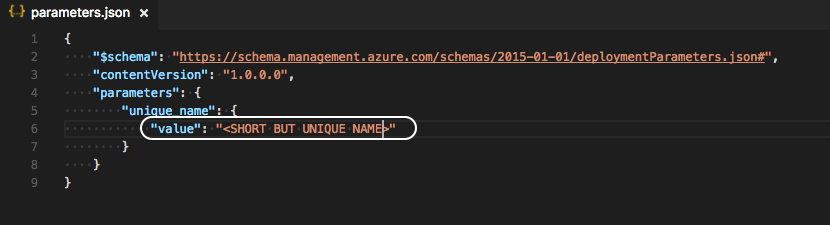
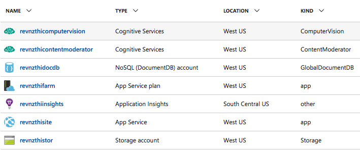

SAMPLE SETUP - Azure Functions tools for Visual Studio 2017
=========================================================
This covers the pre-requisites and set up for the Azure Functions tools for Visual Studio 2017 sample.

## Setup ##
Below are set up instructions for your computer, Azure, and Visual Studio Team Services.

## Machine Pre-requisites ##

Install the following on your machine:

- [Visual Studio 2017 Enterprise Update 3 Preview](https://www.visualstudio.com/vs/preview/) (Enterprise is used for the Live Unit Tests) with the following selected:
    - ASP.NET and Web development
    - Azure development
    - .NET Core cross-platform development
- [Latest Azure Functions tools for Visual Studio 2017](https://marketplace.visualstudio.com/vsgallery/e3705d94-7cc3-4b79-ba7b-f43f30774d28). When you first use this it will also install the Azure Functions CLI tools. 
- [Microsoft .NET Framework 4.6.2 Developer Pack](http://getdotnet.azurewebsites.net/target-dotnet-platforms.html)
- [Azure PowerShell](https://azure.microsoft.com/en-us/downloads/) or the [Azure CLI 2.0](https://docs.microsoft.com/en-us/cli/azure/install-azure-cli) (for the ARM template deployment)
- [Git tools for Windows](https://git-scm.com/download/win)
- Optional: [Continuous Delivery Tools for Visual Studio](https://marketplace.visualstudio.com/items?itemName=VSIDEDevOpsMSFT.ContinuousDeliveryToolsforVisualStudio) 

---
Notes: 
- You can still use the sample with other editions of `Visual Studio 2017 Update 3 Preview` (like Community), but Live Unit Tests feature won't be available.
- `Continuous Delivery Tools for Visual Studio` is needed to show the status of automated builds for your function, and is optional if you won't set up Visual Studio Team Services.
---

## Fork the Repo and Clone it ##
- Fork this repo to your own GitHub account
- Clone your fork to a folder of your preferenceon  your machine. Or, if you downloded a zip file of the sample, expand the zip file to your preferred folder.
- Windows may block Powershell and Batch script execution if the OS determines the scripts originated from an untrusted source. To bypass this, run ``Get-ChildItem -Recurse -Path 'c:\Code' | Unblock-File`` (*replacing the path value with your target code root*).
- In order to run non-digitally signed Powershell scripts you will need to run ``Set-ExecutionPolicy -ExecutionPolicy Unrestricted``.

## Azure ##

Follow these instructions to get your Azure subscription set up. 

- Edit the ``parameters.json`` file under the ``\Provision\assets`` folder and set the value of ``unique_name`` to a short unique value. This will be used for all asset names (cognitive services, storage accounts, web app and service plan, documentDB) so make sure it's unique:



- Deploy the provided ARM template using the modified ``parameters.json`` and the ``template.json`` file under the ``\Provision\assets`` folder to your Azure Subscription. 
    - Via PowerShell: There is a ``deploy.ps1`` file provided. Run it as Administrator and follow the prompts.
    - If you prefer to do it via the Azure CLI 2.0 these are the commands to run from the ``\Provision\assets`` folder:

| Command | Notes |
|---------|-------|
|``az login``|If you're not already logged in. Log in with an account that has owner/administrator permissions to the Azure Subscription.|
|``az account set --subscription <YOUR SUB ID>``|Set the subscription that you will be deploying to. Substitute ``<YOUR SUB ID>`` with your subscription ID|
|``az group create --name Reviews --location "West US"`` |Creates a new Resource Group called Reviews in West US. You can change the region but double check it supports all that gets deployed by the ARM template (Computer Vision and Content Moderator Cognitive Services, CosmosDB, Azure Storage (Standard), Application Insights, Azure Web App, Shared Dashboards)| 
|``az group deployment create --name ReviewsDeploy --resource-group Reviews --template-file template.json --parameters @parameters.json --verbose``|Deploys the ARM template|

You should now have a resource group called Reviews in your Azure subscription with all the assets needed on Azure for the sample. For example, if the unique name chosen was **revnzthi** the following services would show up in the Reviews resource group:



---
Notes:
- There is also a Shared Dashboard called ``Reviews Insights`` that gets created in the Reviews resource group for you to use on the sample. Shared Dashboards don't show up in the default Resource Group items view yet. 
- The Application Settings in the Web App should have all the right configurations and connection strings to the CosmosDB database and Storage accounts for the website in the sample to use.
---

## Pre-configure Storage and CosmosDB ##

Now that you have created the resource group with all the assets on your Azure subscription, populate the CosmosDB database and Storage account with some initial data:

- Open the ``config.xml`` file in the ``\Reset`` folder and edit the values for the following (from the assets you just deployed to your Azure Subscription):
    - ``storageConnectionString`` (Storage accounts > [uniquename]stor > Access Keys)
    - ``documentDbEndpoint`` (Azure Cosmos DB > [uniquename]docdb > Keys > URI)
    - ``documentDbKey`` (Azure Cosmos DB > [uniquename]docdb > Keys > Primary Key)

-  Right click on the ``Reset.cmd`` file and select ``Run as Administrator`` and click Yes to confirm. This will:
    - Add entries to CosmosDB and create a collection in it if it's the first time you run it; don't worry if there is an error saying ``Resource Not Found``, this just means it had to create the CosmosDB collection because it wasn't there yet
    - Add related images to Blob storage that correspond to the CosmosDB entries.

---
Note:
- You can easily change this sample from 'Cats and Dog' to a different Reviews site; you would have to change the sample images and the Function code that calls Cognitive Services to match the types of images being used.
---

## Deploy the Website Code ##

Now let's deploy the Reviews site code to the Web App:
- Open Visual Studio 2017 Update 3
- Open the ``CatsReviewApp.sln`` solution from the ``\Source\CatsReviewApp`` folder
- Right click and build the web app in Visual Studio to ensure it is building working correctly
- Right click the ``CatReviewsApp `` project and select ``Publish``. Follow the publish web app wizard to publish to an **existing App Service**, then choose the web app in the Reviews resource group in your Azure Subscription.
- Once the site has been published, click the link to it from the Output window in Visual Studio. You should see the website up and running, showing four Approved Cat reviews and one Rejected:


## Optional: Visual Studio Team Services ##

You can also create a VSTS build definition to trigger from a code commit. To get it set up, follow these instructions: 
- Use an existing VSTS account or [create a new one](https://www.visualstudio.com/en-us/docs/setup-admin/team-services/sign-up-for-visual-studio-team-services)
- [Make sure you have Colin's ALM Corner Build & Release Tools installed on your VSTS account](https://marketplace.visualstudio.com/items?itemName=colinsalmcorner.colinsalmcorner-buildtasks)
- [Create a Personal Access Token (PAT)](https://www.visualstudio.com/en-us/docs/setup-admin/team-services/use-personal-access-tokens-to-authenticate) and save the value.
- Create a new Build Definition as documented in [this blog post](https://blogs.msdn.microsoft.com/appserviceteam/2017/06/01/deploying-visual-studio-2017-function-projects-with-vsts/) using your GitHub fork as the source
- Create the following variables for your new build definitions:
    - AzureWebJobsStorage
    - MicrosoftVisionApiKey
    - ContentModerationApiKey
    - customerReviewDataDocDB
    - APPINSIGHTS_INSTRUMENTATIONKEY
- Add the `Replace Tokens` task between the `Build Solution` and `Test Assemblies` tasks. This task will replace the values in `local.settings.json` with the values in the variables. Configure the settings in this task with the following values:
    - sourcePath: ContentModeratorFunction/bin/$(BuildConfiguration)
    - filePattern: local.settings.json
    - tokenRegex: __(\\w+)__
-  Queue a new build run - the build summary should show the two tests passed:


## Before Running the Sample ##
- If following Section 2 of the sample (VSTS):
    - Open Visual Studio 2017 Update 3 and open the Team Explorer window
    - Go to Manage Connections (acessed by clicking the the green wall socket plug button) and connect to your VSTS account
- Open a browser with three tabs open:
    - The Cat Reviews website that you created during set up
    - The last successful Build in your Visual Studio Team Services account 
    - The Azure Portal with the Review Insights shared dashboard selected
- Open Visual Studio and open the ``ContentModerator.sln`` solution and:
    - Edit the settings in the ``local.settings.json`` file in the ``ContentModeratorFunction`` project with the right connection strings for your Azure Storage and CosmosDB accounts 
    - Start local debugging of the reviews function without any breakpoints, so that the uploaded images are processed by the function
    - Click around the Reviews website for a while to generate some general Application Insights data
    - Use the images in the ``\Reset\Assets`` folder and put a few cat and non-cat images through (or find more cat and dog images online that allow for commercial reuse) 
    - Make sure to put some cat and dog images through and enter a text that will fail the text context moderation too (with a swear word for example). This is so we have the four content moderation results populated in Application Insights:
        - Passed image and text moderation
        - Failed image moderation
        - Failed text moderation
        - Failed image and text moderation
- Run the reset script again (instructions above in the ``Pre-configure Storage and CosmosDB`` section). This won't reset the application insights data, only CosmosDB and Storage.
- Trigger a few VSTS builds by either manually triggering them from the VSTS site, or commiting small changes to the code in your fork. Double check that these builds are showing in the Builds section of the Team Explorer window in Visual Studio.
- Back in Visual Studio:
    - Change the code of ReviewImageAndText to only do the Text moderation only and not the vision (as you add the vision code during the sample run). I.e.:
    ```
            bool passesText = await PassesTextModeratorAsync(inputDocument);

            inputDocument.IsApproved = passesText;
            bool containsCat = true;

            EmitCustomTelemetry(containsCat, passesText);
    ```
    - Select File -> New -> Azure Function from the Cloud menu. This is the starting view for the sample. 
    - [Start Live Unit Testing](https://blogs.msdn.microsoft.com/visualstudio/2017/03/09/live-unit-testing-in-visual-studio-2017-enterprise/) and make sure the tests are passing in the function code.

## Optional: Clean Up ##

If you want to clean up the sample:
- Delete the 'Reviews' resource group from your Azure subscription
- Delete the 'Reviews' project from your Visual Studio Team Services account
- Delete the folder on your machine where you cloned the repo(s)
- Delete the fork of the code from your GitHub account 